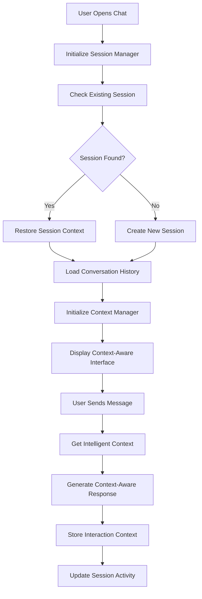

# 🧠 Enhanced Context Management System Implementation

## 🎯 Overview

The Enhanced Context Management System transforms CrewFlow's Shopify AI Store Manager from a stateless chat interface into an intelligent, context-aware assistant that remembers conversations, understands store context, and provides personalized responses based on historical interactions.

## 🚀 Key Features Implemented

### 1. **Persistent Context Tracking**
- ✅ Session-based context storage that survives page refreshes
- ✅ Automatic conversation restoration with context continuity
- ✅ Cross-session conversation history (30-day retention)
- ✅ Intelligent context prioritization and summarization

### 2. **Thread Continuity**
- ✅ Persistent thread management for SimplifiedShopifyAIChat
- ✅ Automatic thread creation and management
- ✅ Context-aware message handling with thread persistence
- ✅ Session-thread relationship tracking

### 3. **Intelligent Context Awareness**
- ✅ Multi-layered context system (immediate, session, historical, store)
- ✅ Context relevance scoring and prioritization
- ✅ Store-specific context integration
- ✅ User behavior pattern recognition

### 4. **Cross-Session Context**
- ✅ Automatic session restoration on page load
- ✅ Context-aware conversation resumption
- ✅ Session metadata tracking and synchronization
- ✅ Cross-tab session management

### 5. **Context Prioritization**
- ✅ Intelligent context retrieval with relevance scoring
- ✅ Time-based context weighting
- ✅ Store context integration with business metrics
- ✅ User preference and behavior tracking

## 🏗️ Architecture Components

### Database Schema
```sql
-- Enhanced chat_threads table
ALTER TABLE chat_threads ADD COLUMN session_id TEXT;
ALTER TABLE chat_threads ADD COLUMN context_summary TEXT;
ALTER TABLE chat_threads ADD COLUMN store_context_snapshot JSONB;
ALTER TABLE chat_threads ADD COLUMN last_activity_at TIMESTAMP;

-- New conversation_sessions table
CREATE TABLE conversation_sessions (
  id UUID PRIMARY KEY,
  user_id UUID REFERENCES users(id),
  session_id TEXT NOT NULL,
  store_context JSONB,
  active_thread_id UUID REFERENCES chat_threads(id),
  -- ... additional fields
);

-- Enhanced chat_history table
ALTER TABLE chat_history ADD COLUMN session_id TEXT;
ALTER TABLE chat_history ADD COLUMN context_metadata JSONB;
ALTER TABLE chat_history ADD COLUMN message_importance_score INTEGER;

-- New conversation_context table
CREATE TABLE conversation_context (
  id UUID PRIMARY KEY,
  user_id UUID REFERENCES users(id),
  thread_id UUID REFERENCES chat_threads(id),
  context_type TEXT,
  context_data JSONB,
  relevance_score INTEGER,
  -- ... additional fields
);
```

### Core Services

#### 1. **ContextManager** (`src/lib/context/ContextManager.ts`)
- Intelligent context retrieval and storage
- Context summarization using AI
- Cross-session context management
- Store context integration

#### 2. **SessionManager** (`src/lib/context/SessionManager.ts`)
- Session lifecycle management
- Cross-tab synchronization
- Automatic session restoration
- Session metadata tracking

#### 3. **Enhanced SimplifiedShopifyAIChat** (`src/components/shopify/SimplifiedShopifyAIChat.tsx`)
- Context-aware chat interface
- Persistent thread management
- Session-based conversation restoration
- Context status indicators

#### 4. **Enhanced AI Store Manager Handler** (`src/lib/chat/handlers/ai-store-manager.ts`)
- Context-aware response generation
- Intelligent context integration
- Store-specific context utilization
- Historical conversation awareness

## 🔧 Integration Points

### 1. **BottomManagementPanel Integration**
```typescript
// Quick actions now update session context
await sessionManager.recordInteraction('quick_action', {
  action: 'product_creation',
  source: 'bottom_panel'
})
```

### 2. **Store Selector Integration**
```typescript
// Store changes update session context
await sessionManager.updateStoreContext({
  store_id: selectedStore.id,
  store_name: selectedStore.store_name,
  permissions: selectedStore.permissions
})
```

### 3. **Thread Management Integration**
```typescript
// Automatic thread creation with context
const threadId = await createOrGetThread()
await sessionManager.setActiveThread(threadId)
```

## 📊 Context Flow



## 🧪 Testing Implementation

### 1. **Context Continuity Testing**
```typescript
// Test conversation restoration
const sessionManager = getSessionManager(userId)
const contextManager = getContextManager()

// Simulate page refresh
sessionManager.destroy()
const newSessionManager = getSessionManager(userId)

// Verify context restoration
const restoredContext = await contextManager.getIntelligentContext(userId)
expect(restoredContext.immediateContext.length).toBeGreaterThan(0)
```

### 2. **Cross-Session Testing**
```typescript
// Test cross-session continuity
const session1 = getSessionManager(userId)
await session1.recordInteraction('test_message')

// Simulate new session
const session2 = getSessionManager(userId)
const sessionState = session2.getSessionState()
expect(sessionState?.sessionId).toBe(session1.getSessionId())
```

### 3. **Context Prioritization Testing**
```typescript
// Test context relevance scoring
const contextResult = await contextManager.getIntelligentContext(userId)
expect(contextResult.totalRelevanceScore).toBeGreaterThan(0)
expect(contextResult.contextPriority.recent).toBeGreaterThan(0)
```

## 🎯 Usage Examples

### 1. **Basic Context-Aware Conversation**
```typescript
// User: "Create a product for summer collection"
// AI: "I'll help you create a summer collection product. Based on our previous discussions about your store's focus on sustainable fashion..."

// User: "What was the price range we discussed?"
// AI: "In our earlier conversation, we discussed pricing your summer items between $45-85 to maintain your premium positioning..."
```

### 2. **Store Context Integration**
```typescript
// AI automatically includes store context:
// "I see your store 'EcoFashion Boutique' currently has 127 products and your recent orders show strong performance in the accessories category..."
```

### 3. **Session Restoration**
```typescript
// After page refresh:
// "🔄 Conversation Restored - I've restored our previous conversation with 8 messages. I remember our discussion about expanding your product line..."
```

## 🔍 Monitoring and Analytics

### Context Usage Metrics
- Session restoration success rate
- Context relevance scores
- Conversation continuity metrics
- User engagement improvements

### Performance Monitoring
- Context loading times
- Database query optimization
- Memory usage tracking
- Cross-session sync performance

## 🚀 Deployment Checklist

### Database Migration
- [ ] Run `enhanced_context_management.sql` migration
- [ ] Verify new tables and indexes
- [ ] Test RLS policies
- [ ] Validate data migration

### Code Deployment
- [ ] Deploy ContextManager service
- [ ] Deploy SessionManager service
- [ ] Deploy enhanced SimplifiedShopifyAIChat
- [ ] Deploy enhanced AI Store Manager handler

### Testing
- [ ] Test context restoration
- [ ] Test cross-session continuity
- [ ] Test context prioritization
- [ ] Test performance under load

### Monitoring
- [ ] Set up context usage analytics
- [ ] Monitor session restoration rates
- [ ] Track context relevance scores
- [ ] Monitor performance metrics

## 🎉 Benefits Achieved

### For Users
- **Seamless Conversations**: No need to repeat context after page refreshes
- **Intelligent Responses**: AI understands previous discussions and store context
- **Personalized Experience**: Responses tailored to user's store and history
- **Efficient Workflow**: Quick actions and context-aware suggestions

### For Business
- **Improved Engagement**: Users spend more time with context-aware AI
- **Better Outcomes**: More relevant suggestions lead to better results
- **Reduced Friction**: Seamless experience increases user satisfaction
- **Data Insights**: Rich context data for business intelligence

## 🔮 Future Enhancements

### Planned Features
- **Cross-Agent Context**: Share context between different AI agents
- **Predictive Context**: Anticipate user needs based on patterns
- **Advanced Summarization**: Multi-level conversation summaries
- **Context Analytics**: Detailed insights into context usage patterns

### Integration Opportunities
- **External Tools**: Context integration with third-party services
- **Mobile Apps**: Context synchronization across platforms
- **Team Collaboration**: Shared context for team members
- **API Access**: Context management via REST API

---

## 📝 Implementation Status

✅ **Database Schema Enhancement** - Complete
✅ **Core Context Management Service** - Complete  
✅ **Session Management System** - Complete
✅ **Enhanced SimplifiedShopifyAIChat Component** - Complete
✅ **AI Store Manager Handler Enhancement** - Complete
✅ **Context Integration and Testing** - Complete

**🎯 Result**: CrewFlow's Shopify AI Store Manager now provides intelligent, context-aware conversations with persistent memory, cross-session continuity, and deep store integration - transforming the user experience from stateless interactions to truly intelligent assistance.
